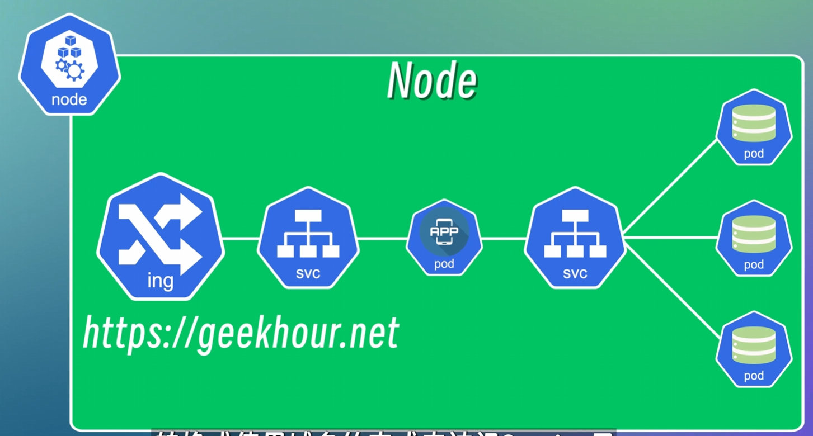
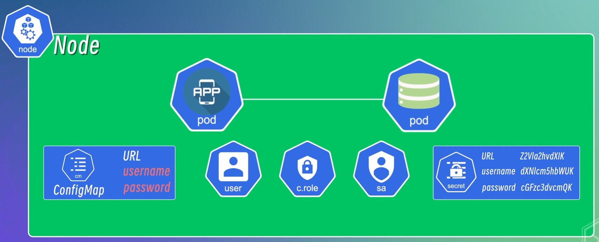
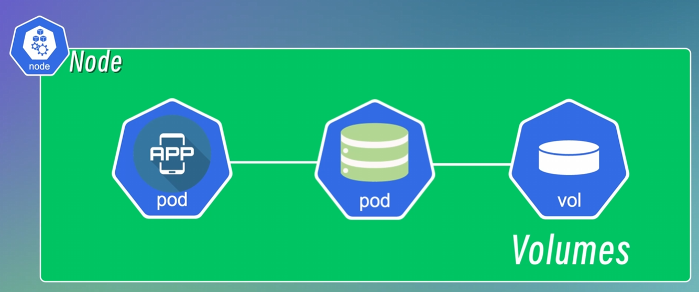
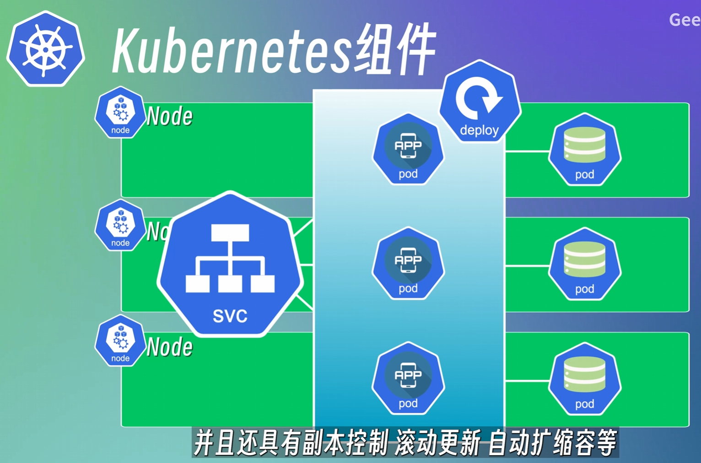
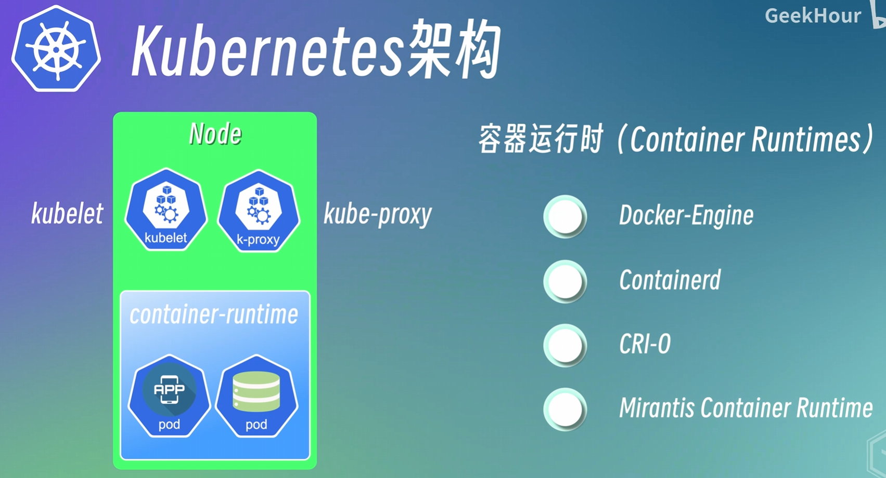
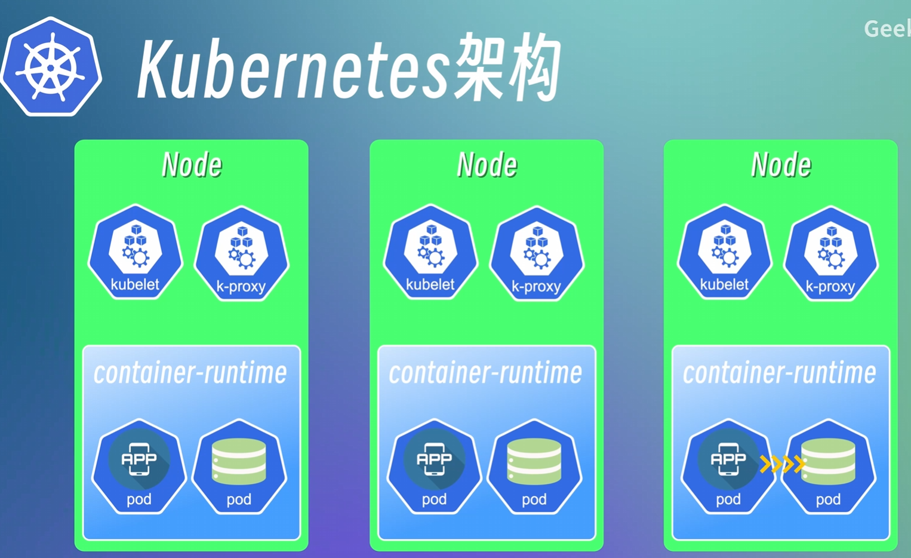
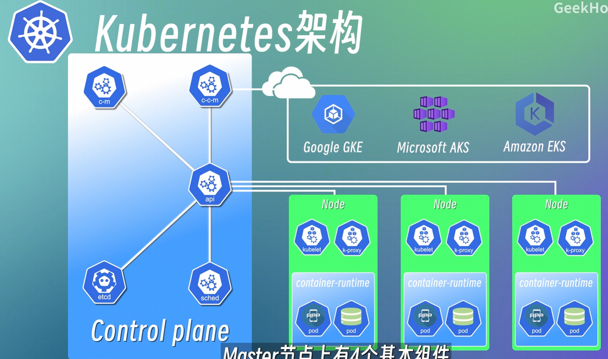

## 简介

container的好处在于提升部署效率，调高稳定性并且降低成本等。

当容器数量少的时候可以用shell进行管理，当容器数量多的时候使用脚本管理很困难。

k8s是由Google开源的容器编排引擎。

## 组件

一个节点（node）就是一个物理机或者虚拟机，在一个node中可以有多个Pod。

Pod是k8s的最小调度单元，一个Pod是一个或者多个container的组合。一般情况下一个pod中放一个容器。

### svc

一个node中的pod相互之间通过IP地址访问，pod的IP地址在创建时自动分配，对于node外不可见。

pod并不稳定，若pod中容器出现问题则会销毁当下pod重新生成一个装载原容器的pod，但IP地址会变。

为了解决由于IP地址变化导致pod通信问题，Node中引入了Service服务，将一组Pod封装成一个服务。

当某一个pod由于错误导致IP地址发生了变化，service的地址是不会变化的，会将pod的请求转发到其余健康的pod上。

这种服务称为内部服务，因为我们不想暴漏给外部。

外部服务：诸如node:port。node在节点上开放一个端口，我们可以通过节点的IP地址和端口访问service。

### ing

但是这种只适合于开发环境。在生产环境中都是用URL。我们引入了Ingress，它是用来控制访问集群内部服务的入口和方式的，可以将外部访问请求通过路由转发方式到svc。也可以通过Ingress配置域名。

### configMap

在一般情况下，应用的配置文件中会存储数据库的URL，username和pwd等。当数据库的地址和用户发生变化时则需要更改应用的配置文件，存在耦合度。

为了解决这个问题，引入ConfigMap，存储数据库相关信息，当数据库发生变化时只需更改configmap中的信息。

然而，ConfigMap是明文，若存储隐私信息需要其余配件诸如secret（base 64 编码），网络安全，访问控制，身份认证等。

### vol

数据库中的数据可以备份在volume中，当数据库被销毁重启时可以从volume调出数据。

## deploy与sts

在需要服务24小时运行的情况下，当Node中的应用程序需要维护或者故障时则无法正常从外部访问。为了避免这个问题，我们可以将node创建多个副本，并统一链接到同一个svc。多个node中的应用可以由deployment管理，可以简化node的更新管理和部署操作。

pod可以理解为在容器上层加了一个抽象，可以将一个或者多个容器组合到一起。deploy可以理解为在多个pod上加了抽象。

它会自动升级维护应用，当某一个node中的应用不能用时会自动将请求往其余节点发送。并且提供定义与维持副本数量的服务，当某一node中的应用不能用时则会自动重新生成新的应用程序暂时替代。

每一个node中的数据库要维持其数据一致，可以用statefulSet进行管理，与deploy类似，对数据库提供了定义和管理副本数量，或者动态扩缩容等。

每一个数据库有其自身的状态，类似数据库缓存，消息队列等，以及需要保留会话状态的应用，都需要sts部署。

更加常用的方法是把数据库和有状态的应用程序从node中剥离出来，在集群外单独部署。

## 架构

k8s是一个Master-Worker架构，Master负责管理整个集群，Worker-Node负责运行应用程序和服务。

一个Node为了能够对外提供服务，都会包含三个组件。分别为kubelet，kube-poxy和container-runtime

### node

container-runtime叫容器运行时，可以理解为运行容器的软件，负责拉容器镜像，创建容器，启动或者停止容器等。

在docker中的容器运行时叫docker-engine，在k8s中可以使用除docker-engine外的容器运行时（如图所示）。

kubelet主要负责管理和维护每个节点上的pod，确保它们按照预期运行。会定期从api-server接收新的或者修改后的pod规范，也会监控pod的运行情况，将信息汇报给api-server

kube-proxy为pod对象提供网络代理和负载均衡服务。通常情况下，多个Node之间通过svc通信，这就需要一个负载均衡器接收请求，将请求发送到不同pod上。

例如我们访问一个服务，ing将访问转移到某一个Node，而k-proxy确保了Node中的应用会访问此Node中的数据库。

**外部访问的负载均衡由ing负责，内部的负载均衡由k-proxy负责**

### master

如何监控节点的状态，如何增删节点，如何将pod部署在node中，都是master的任务。

Master节点上由四个基本组件，kube-apiserver，etcd，controllerManager和Scheduler。

api-server：所有访问节点的请求都会经过api-server，类似于所有Node的网关。还负责对所有资源对象的增删改查进行认证，授权和访问控制。

Scheduler（调度器）：负责监控整个集群中所有结点的资源使用情况。将新pod自动部署到压力小的结点。

ControllerManager：负责管理集群中各种资源对象的状态。当有pod损坏时自动替换。

etcd（高可用的键值存储系统）：类似redis，用来存储集群中所有资源对象的状态信息。注意数据库中的数据不会存在这里。

CloudControllerManager：云平台相关的控制器，负责与云平台的API负责交互。让用户可以在不同的云平台中管理和运行他们的应用程序。

